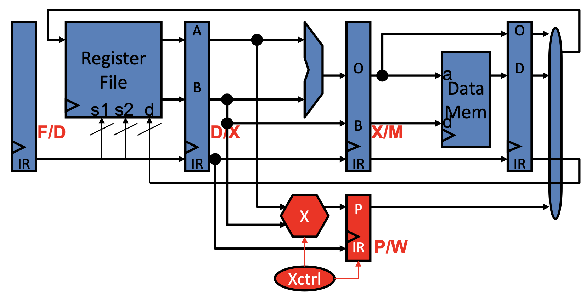

# ECE 350 - Five-Stage Pipelined RISCV Processor Capable of Executing MIPS Assembly

## Overview

This repository contains a five-stage, single-issue, 32-bit pipelined processor implemented entirely in
structural Verilog, built for ECE 350, Digital Systems. The design integrates a register file, ALU,
and mult/div unit, and implements a full custom ISA with pipeline hazard detection, bypassing,
and stalling.

## Pipeline

The processor contains the classic RISC pipeline for increasing instruction throughput, consisting of 5 stages: Fetch(F), Decode(D), Execute(X), Memory(M), and Writeback(W).

## Instruction Set (ISA)

The processor implements the full ISA below, across R-type, I-type, JI-type, and JII-type
instructions.

| Instruction | Opcode (ALU op) | Type | Operation |
|---|---|---|---|
| `add $rd, $rs, $rt` | 00000 (00000) | R | `$rd = $rs + $rt`; `$rstatus = 1` if signed overflow |
| `addi $rd, $rs, N` | 00101 | I | `$rd = $rs + N`; `$rstatus = 2` if signed overflow |
| `sub $rd, $rs, $rt` | 00000 (00001) | R | `$rd = $rs - $rt`; `$rstatus = 3` if signed overflow |
| `and $rd, $rs, $rt` | 00000 (00010) | R | `$rd = $rs & $rt` |
| `or $rd, $rs, $rt` | 00000 (00011) | R | `$rd = $rs \| $rt` |
| `sll $rd, $rs, shamt` | 00000 (00100) | R | `$rd = $rs << shamt` |
| `sra $rd, $rs, shamt` | 00000 (00101) | R | `$rd = $rs >>> shamt` |
| `mul $rd, $rs, $rt` | 00000 (00110) | R | `$rd = $rs * $rt`; `$rstatus = 4` if signed overflow |
| `div $rd, $rs, $rt` | 00000 (00111) | R | `$rd = $rs / $rt`; `$rstatus = 5` if exception |
| `sw $rd, N($rs)` | 00111 | I | `MEM[$rs + N] = $rd` |
| `lw $rd, N($rs)` | 01000 | I | `$rd = MEM[$rs + N]` |
| `j T` | 00001 | JI | `PC = T` |
| `bne $rd, $rs, N` | 00010 | I | `if ($rd != $rs) PC = PC + 1 + N` |
| `jal T` | 00011 | JI | `$r31 = PC + 1, PC = T` |
| `jr $rd` | 00100 | JII | `PC = $rd` |
| `blt $rd, $rs, N` | 00110 | I | `if ($rd < $rs) PC = PC + 1 + N` |
| `bex T` | 10110 | JI | `if ($rstatus != 0) PC = T` |
| `setx T` | 10101 | JI | `$rstatus = T` |
| `custom_r $rd, $rs, $rt` | 00000 (01000-11111) | R | `$rd = custom_r($rs, $rt)` (reserved for Final Project) |
| `custom ...` | xxxxx+ | X | Reserved for Final Project |

### Instruction Machine Code Format

| Type | Field [31:27] | Field [26:22] | Field [21:17] | Field [16:12] | Field [11:7] | Field [6:2] | Field [1:0] |
|---|---|---|---|---|---|---|---|
| **R** | Opcode | `$rd` | `$rs` | `$rt` | shamt | ALU op | Zeroes |
| **I** | Opcode | `$rd` | `$rs` | Immediate (N) [16:0] | | | |
| **JI** | Opcode | Target (T) [26:0] | | | | | |
| **JII** | Opcode | `$rd` | Zeroes [21:0] | | | | |

**Clarifications:**
- I-type immediate field `[16:0]` (N) is signed and sign-extended to a signed 32-bit integer.
- JII-type target field `[26:0]` (T) is unsigned. The PC and STATUS registers' upper bits
  `[31:27]` are guaranteed to never be used.

## Repository / File Structure

```
main/
  proc/                  # All custom Verilog source (submodules: alu, regfile, multdiv)
test_files/
  assembly_files/        # .s test programs
  memory_files/          # Assembled .mem files
  output_files/          # GTKWave outputs
  verification_files/    # Expected register values (*_exp.txt)
config.ini               # Toolchain configuration
```

## Building and Testing

Using the provided toolchain (recommended):
```bash
python autotester.py
```
This compiles the design, runs all active tests, and opens an HTML results page
(green = pass, orange = pass with warnings, red = mismatch, gray = failed to run).

Manual compilation with Icarus Verilog:
```bash
find . -name "*.v" | sort -f > FileList.txt
iverilog -o proc -c FileList.txt -s Wrapper_tb -Wimplicit \
  -P Wrapper_tb.FILE=\"sample\"
vvp proc
```

Checking for banned Verilog constructs:
```bash
python run.py -d <PATH_TO_PROC_FOLDER> -l 4
```
